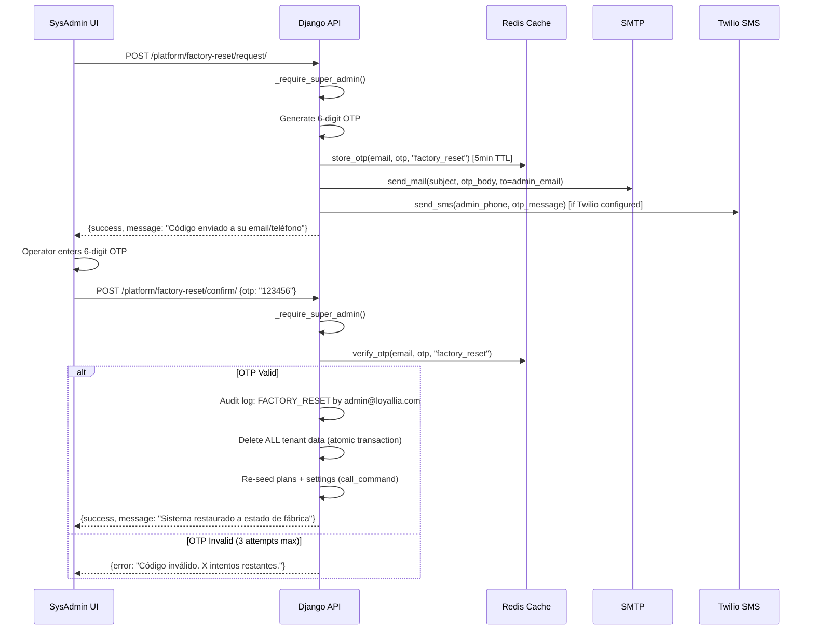
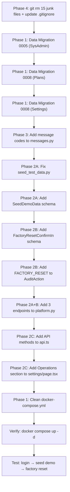

# LYL-BOOT-001: Startup Integrity, Operations Panel & Repository Hygiene

**ISO/IEC 29148:2018 — Software Requirements Specification**
**Version:** 1.0 | **Date:** 2026-05-09 | **Status:** PENDING APPROVAL

---

## 1. Purpose & Scope

### 1.1 Problem Statement

The Loyallia platform has four critical operational gaps:

1. **No bootable system.** The only mechanism creating the SUPER_ADMIN user (`seed_test_data`) has a `DEBUG=True` guard. Docker sets `DEBUG=False` → seed silently fails → **nobody can login**.
2. **No on-demand demo data.** Operators must SSH into containers to run seed commands.
3. **No factory reset.** No mechanism exists to wipe tenant data and restore the platform to its initial state.
4. **Repository pollution.** 15+ tracked files are superseded, duplicated, or build artifacts.

### 1.2 Solution Architecture

| Data Type | Mechanism | Trigger |
|---|---|---|
| **Vital boot data** (SysAdmin, plans, settings) | Django data migrations | `migrate --noinput` — automatic on every deploy |
| **Demo data** (tenants, customers, transactions) | API + SysAdmin UI button | On-demand: operator clicks "Cargar Datos Demo" |
| **Factory reset** (wipe all tenant data) | OTP-verified API + SysAdmin UI button | On-demand: operator clicks "Restaurar de Fábrica", enters OTP |

### 1.3 Existing Infrastructure Reused (Zero New Dependencies)

| Capability | Already Exists | Location |
|---|---|---|
| Twilio SMS sending | ✅ | `apps/notifications/sms/client.py` → `send_sms(phone, message)` |
| OTP generation/storage/verification | ✅ | `apps/authentication/helpers.py` → `store_otp()`, `verify_otp()` |
| Email sending | ✅ | `django.core.mail.send_mail()` via SMTP |
| Redis cache (OTP storage) | ✅ | Django cache backend (Redis) |
| Vault-backed Twilio credentials | ✅ | `twilio_account_sid`, `twilio_auth_token`, `twilio_from_number` in Vault |
| SUPER_ADMIN role gate | ✅ | `_require_super_admin()` in every super_admin_api module |
| Audit logging | ✅ | `apps/audit/service.py` → `log_action()` |

---

## 2. Requirements

### REQ-BOOT-001: System Must Boot to Working State

**Priority:** CRITICAL

The system MUST boot to a fully functional state with `migrate --noinput` alone. After migration:
- One SUPER_ADMIN user exists (`admin@loyallia.com` / `Loyallia@Admin2026!`, `tenant=None`)
- Four subscription plans exist (Trial, Starter, Professional, Enterprise)
- Three platform settings exist (TRIAL_DAYS, TAX_RATE_ECUADOR, DEFAULT_TIMEZONE)
- The operator can immediately login at `/login` and access `/superadmin`

### REQ-BOOT-002: Demo Data On-Demand

**Priority:** HIGH

The SUPER_ADMIN dashboard MUST provide a "Cargar Datos Demo" button that loads demonstration data (tenants, users, customers, transactions, locations) without SSH access.

### REQ-BOOT-003: Factory Reset with OTP Verification

**Priority:** HIGH

The SUPER_ADMIN dashboard MUST provide a "Restaurar de Fábrica" button that:
1. Sends a 6-digit OTP to the SUPER_ADMIN's registered email (primary) AND phone via Twilio SMS (secondary, if configured)
2. Requires the operator to enter the OTP within 5 minutes
3. On verified OTP: wipes ALL tenant data (tenants, users except SUPER_ADMIN, subscriptions, customers, transactions, locations, invoices, passes, programs, notifications, automations, audit logs)
4. Re-seeds the vital boot data (plans, platform settings)
5. Logs the factory reset in a NEW audit entry BEFORE wiping

### REQ-BOOT-004: Idempotent Migrations

**Priority:** CRITICAL

All data migrations MUST be idempotent. Running `migrate --noinput` multiple times MUST NOT duplicate records or overwrite user-modified values.

### REQ-BOOT-005: Repository Hygiene

**Priority:** MEDIUM

All superseded, duplicated, and build artifact files MUST be removed from git tracking.

---

## 3. Proposed Changes

---

### Phase 1: Data Migrations — System Boot Integrity

#### [NEW] 0005_ensure_superadmin.py

```python
# Django RunPython data migration
def ensure_superadmin(apps, schema_editor):
    User = apps.get_model("authentication", "User")
    if User.objects.filter(role="SUPER_ADMIN").exists():
        return  # Idempotent
    from django.contrib.auth.hashers import make_password
    import uuid
    User.objects.create(
        id=uuid.uuid4(),
        email="admin@loyallia.com",
        password=make_password("Loyallia@Admin2026!"),
        first_name="Sistema", last_name="Admin",
        role="SUPER_ADMIN", tenant=None,
        is_staff=True, is_superuser=True, is_active=True,
    )
```

- Depends on: `0004_user_security_pin_hash`
- Reverse: `noop`

---

#### [NEW] 0008_seed_vital_plans.py

Seeds the 4-tier plan structure using `update_or_create(slug=...)`. Exact same data as existing `seed_subscription_plans` command. Does NOT overwrite admin-edited fields on existing plans (uses `update_or_create` with slug as the lookup key).

- Depends on: `0007_add_rate_limit_fields`

---

#### [NEW] 0008_seed_platform_settings.py

Seeds 3 defaults using `get_or_create` — NEVER overwrites existing values.

- Depends on: `0007_alter_tenant_scheduled_deletion_at`

---

#### [MODIFY] docker-compose.yml (lines 361-366)

```diff
     command: >
       sh -c "python manage.py migrate --noinput &&
       python manage.py collectstatic --noinput &&
-      (python manage.py seed_subscription_plans 2>/dev/null || true) &
-      (python manage.py seed_test_data 2>/dev/null || true) &
       python manage.py runserver 0.0.0.0:8000"
```

---

### Phase 2: SysAdmin Operations Panel

#### 2A. Seed Demo Data

##### [MODIFY] seed_test_data.py

Two fixes:

**Fix 1 — Remove DEBUG guard (lines 55-57):**
The API endpoint is gated by SUPER_ADMIN role — that IS the security boundary, not DEBUG mode.

```diff
-        if not settings.DEBUG:
-            self.stderr.write("ERROR: Seed commands can only run in DEBUG mode.")
-            return
```

**Fix 2 — Fix SUPER_ADMIN tenant assignment (lines ~111-124):**

```diff
         admin, _ = User.objects.get_or_create(
             email="admin@loyallia.com",
             defaults={
                 "first_name": "Sistema",
                 "last_name": "Admin",
                 "role": UserRole.SUPER_ADMIN,
-                "tenant": tenant,
+                "tenant": None,
                 "is_active": True,
+                "is_staff": True,
+                "is_superuser": True,
             },
         )
-        if not admin.tenant:
-            admin.tenant = tenant
+        if admin.tenant is not None:
+            admin.tenant = None
+            admin.is_staff = True
+            admin.is_superuser = True
         admin.set_password("123456")
         admin.save()
```

##### [MODIFY] platform.py

New endpoint:

```python
@router.post("/platform/seed-demo-data/", auth=jwt_auth, summary="Cargar datos demo")
def seed_demo_data(request):
    _require_super_admin(request)
    from django.core.management import call_command
    from io import StringIO
    output = StringIO()
    call_command("seed_test_data", stdout=output, stderr=output)
    logger.info("SUPER_ADMIN %s triggered demo data seed", request.user.email)
    return {"success": True, "message": get_message("ADMIN_DEMO_SEEDED"),
            "output": output.getvalue()}
```

---

#### 2B. Factory Reset with OTP Verification

**Flow Diagram:**



##### [MODIFY] platform.py

Two new endpoints:

**Endpoint 1 — Request Factory Reset (send OTP):**

```python
@router.post("/platform/factory-reset/request/", auth=jwt_auth)
def factory_reset_request(request):
    """Send OTP to SUPER_ADMIN email+phone for factory reset verification."""
    _require_super_admin(request)
    
    import secrets
    otp = f"{secrets.randbelow(900000) + 100000}"  # 6-digit
    
    from apps.authentication.helpers import store_otp
    store_otp(request.user.email, otp, "factory_reset")
    
    # Primary: Email
    from django.core.mail import send_mail
    send_mail(
        subject="Loyallia — Código de Verificación para Restaurar de Fábrica",
        message=f"Su código de verificación es: {otp}\n\nExpira en 5 minutos.\n\n"
                f"Si no solicitó esto, ignore este mensaje.",
        from_email=settings.DEFAULT_FROM_EMAIL,
        recipient_list=[request.user.email],
    )
    
    # Secondary: SMS via Twilio (if configured)
    sms_sent = False
    phone = getattr(request.user, "phone_number", "")
    if phone:
        try:
            from apps.notifications.sms.client import send_sms, is_sms_available
            if is_sms_available():
                send_sms(phone, f"Loyallia Factory Reset Code: {otp}")
                sms_sent = True
        except Exception:
            logger.warning("SMS send failed for factory reset OTP", exc_info=True)
    
    logger.warning("FACTORY RESET requested by %s (sms=%s)", 
                    request.user.email, sms_sent)
    return {"success": True, 
            "message": get_message("ADMIN_FACTORY_OTP_SENT"),
            "sms_sent": sms_sent}
```

**Endpoint 2 — Confirm Factory Reset (verify OTP, wipe data):**

```python
@router.post("/platform/factory-reset/confirm/", auth=jwt_auth)
def factory_reset_confirm(request, payload: FactoryResetConfirmIn):
    """Verify OTP and execute factory reset. IRREVERSIBLE."""
    _require_super_admin(request)
    
    from apps.authentication.helpers import verify_otp
    if not verify_otp(request.user.email, payload.otp, "factory_reset"):
        raise HttpError(403, get_message("ADMIN_FACTORY_OTP_INVALID"))
    
    # Audit BEFORE wipe (so the log entry survives)
    try:
        from apps.audit.models import AuditAction
        from apps.audit.service import log_action
        log_action(
            request=request, action=AuditAction.FACTORY_RESET,
            resource_type="platform", resource_id="system",
            details={"triggered_by": request.user.email},
            status="SUCCESS",
        )
    except Exception:
        pass
    
    with transaction.atomic():
        # Wipe order: deepest dependencies first
        from apps.notifications.models import DeliveryLog, Notification
        from apps.automation.models import Automation, AutomationExecution
        from apps.transactions.models import Transaction
        from apps.customers.models import Customer, CustomerPass
        from apps.cards.models import LoyaltyProgram
        from apps.billing.models import Invoice, Subscription, WebhookEvent
        from apps.authentication.models import RefreshToken
        
        # Delete all non-SUPER_ADMIN data
        DeliveryLog.objects.all().delete()
        Notification.objects.all().delete()
        AutomationExecution.objects.all().delete()
        Automation.objects.all().delete()
        CustomerPass.objects.all().delete()
        Transaction.objects.all().delete()
        Customer.objects.all().delete()
        LoyaltyProgram.objects.all().delete()
        Invoice.objects.all().delete()
        WebhookEvent.objects.all().delete()
        Subscription.objects.all().delete()
        RefreshToken.objects.all().delete()
        Location.objects.all().delete()
        User.objects.exclude(role=UserRole.SUPER_ADMIN).delete()
        Tenant.objects.all().delete()
    
    # Re-seed vital data (plans + settings)
    from django.core.management import call_command
    call_command("seed_subscription_plans", stdout=StringIO())
    call_command("seed_platform_settings", stdout=StringIO())
    
    logger.critical("FACTORY RESET executed by %s", request.user.email)
    return {"success": True, "message": get_message("ADMIN_FACTORY_RESET_DONE")}
```

##### [MODIFY] schemas.py

Add schema:

```python
class FactoryResetConfirmIn(BaseModel):
    """OTP confirmation for factory reset. IRREVERSIBLE."""
    otp: str = Field(..., min_length=6, max_length=6)
```

##### [MODIFY] audit/models.py

Add `FACTORY_RESET` to `AuditAction` choices if not already present.

---

#### 2C. Frontend — Operations Section

##### [MODIFY] settings/page.tsx

New "Operaciones del Sistema" card inserted between Integrations and Broadcast sections (~line 501). Contains:

**Section 1 — Datos de Demostración:**
- Description text
- "Cargar Datos Demo" button (blue/brand color)
- `window.confirm()` before execution
- Shows result log after success

**Section 2 — Restaurar de Fábrica:**
- Red/danger aesthetic card with warning icon
- Description: "Elimina TODOS los datos de tenants, clientes y transacciones. El sistema regresa a estado inicial con solo el SysAdmin y planes."
- "Solicitar Código de Verificación" button → calls `/factory-reset/request/`
- OTP input field (6 digits) appears after code is sent
- "Confirmar Restauración" button → calls `/factory-reset/confirm/` with OTP
- Shows status: "Código enviado a email + SMS" or "Solo email (SMS no configurado)"
- Full `window.confirm("ÚLTIMA ADVERTENCIA: ¿Restaurar el sistema a estado de fábrica?")` before the confirm call

##### [MODIFY] api.ts

Add to `superAdminApi`:

```typescript
seedDemoData: () => 
    api.post('/api/v1/admin/platform/seed-demo-data/'),
factoryResetRequest: () => 
    api.post('/api/v1/admin/platform/factory-reset/request/'),
factoryResetConfirm: (otp: string) => 
    api.post('/api/v1/admin/platform/factory-reset/confirm/', { otp }),
```

---

### Phase 3: I18N Message Registry

##### [MODIFY] messages.py

Add to ES and EN blocks:

```python
# ES
"ADMIN_DEMO_SEEDED": "Datos de demostración cargados exitosamente.",
"ADMIN_FACTORY_OTP_SENT": "Código de verificación enviado a su email y teléfono.",
"ADMIN_FACTORY_OTP_INVALID": "Código inválido o expirado. Intente de nuevo.",
"ADMIN_FACTORY_RESET_DONE": "Sistema restaurado a estado de fábrica exitosamente.",

# EN
"ADMIN_DEMO_SEEDED": "Demo data loaded successfully.",
"ADMIN_FACTORY_OTP_SENT": "Verification code sent to your email and phone.",
"ADMIN_FACTORY_OTP_INVALID": "Invalid or expired code. Try again.",
"ADMIN_FACTORY_RESET_DONE": "System restored to factory state successfully.",
```

---

### Phase 4: Repository Hygiene

#### [DELETE] 15 tracked files

| File | Reason |
|---|---|
| `1Asset 1@2xsomatechdark.png` | Stray brand image at root |
| `backend/source_output.txt` | Debug dump |
| `postgres/init.sql` | Duplicate of `deploy/postgres/` |
| `rules.md` | Superseded by user rules |
| `AGENT.md` | Orphaned agent doc |
| `docs/SRS_Loyallia_v1.0.md` | Superseded by COMPLETE |
| `docs/SRS_Loyallia_part2.md` | Superseded — merged |
| `docs/SRS_Loyallia_PLAN_B_PRODUCTION_RECOVERY.md` | Superseded |
| `docs/TODO_PLAN_B_TRACEABILITY.md` | Superseded |
| `docs/internal-tls-decision.md` | In ARCHITECTURE.md |
| `docs/secret-rotation.md` | In BACKUP_DISASTER_RECOVERY.md |
| `docs/audit/superseded_ALL_105_ISSUES.md` | Self-labeled superseded |
| `docs/audit/superseded_PROJECT_PLAN.md` | Self-labeled superseded |
| `docs/audit/superseded_SECURITY_AUDIT_REPORT.md` | Self-labeled superseded |
| `docs/audit/superseded_VERIFICATION_REPORT.md` | Self-labeled superseded |

#### [DELETE] Empty directory: `postgres/`

#### [MODIFY] .gitignore

```diff
+# Build artifacts & debug output
+full_build.log
+*.sqlite3
+source_output.txt
+test_output.log
+
+# Ruff cache
+.ruff_cache/
+
+# Stray root assets
+1Asset*
```

---

## 4. User Review Required

> [!IMPORTANT]
> **Default SysAdmin credentials:**
> - Email: `admin@loyallia.com`
> - Password: `Loyallia@Admin2026!`
> - Role: `SUPER_ADMIN`, `tenant=None`
> - **This password should be changed on first login.**

> [!WARNING]
> **Factory Reset is IRREVERSIBLE.** It deletes ALL tenant data. The OTP verification + double `window.confirm()` guards are the security boundary. Confirm this is acceptable.

> [!IMPORTANT]
> **OTP Delivery Strategy:**
> - **Primary:** Email via Django `send_mail()` (always attempted)
> - **Secondary:** Twilio SMS via existing `send_sms()` (attempted if `is_sms_available()` returns True)
> - If BOTH fail, the OTP is still stored in Redis — operator can retry or check server logs (OTP is NOT logged for security)

## 5. Open Questions

> [!IMPORTANT]
> 1. Keep `123456` as demo user passwords in `seed_test_data`, or use something else?
> 2. Should factory reset also flush Redis cache (logout all sessions)?
> 3. The `postgres/init.sql` at root is a duplicate — the canonical one is at `deploy/postgres/`. Confirm delete?

---

## 6. Execution Order



---

## 7. Verification Plan

### Automated Tests

```bash
# 1. Boot integrity
docker compose up -d
docker compose exec api python manage.py shell -c "
from apps.authentication.models import User
from apps.billing.models import SubscriptionPlan
from apps.tenants.models import PlatformSetting
u = User.objects.get(email='admin@loyallia.com')
assert u.role == 'SUPER_ADMIN' and u.tenant is None
assert SubscriptionPlan.objects.count() >= 4
assert PlatformSetting.objects.filter(key='TRIAL_DAYS').exists()
print('BOOT INTEGRITY: PASS')
"

# 2. Demo seed via API
curl -X POST http://localhost:33905/api/v1/admin/platform/seed-demo-data/ \
  -H "Authorization: Bearer $TOKEN"
# Expected: 200 {success: true}

# 3. Factory reset request
curl -X POST http://localhost:33905/api/v1/admin/platform/factory-reset/request/ \
  -H "Authorization: Bearer $TOKEN"
# Expected: 200 {success: true, sms_sent: false}
# Check email for OTP
```

### Manual Verification

1. `docker compose up -d` → all healthy
2. Login `admin@loyallia.com` / `Loyallia@Admin2026!` → redirects to `/superadmin`
3. Plans page → 4 plans
4. Settings → "Cargar Datos Demo" → click → confirm → demo data appears in Tenants page
5. Settings → "Solicitar Código" → check email → enter OTP → confirm → system wiped → only SysAdmin + plans remain
