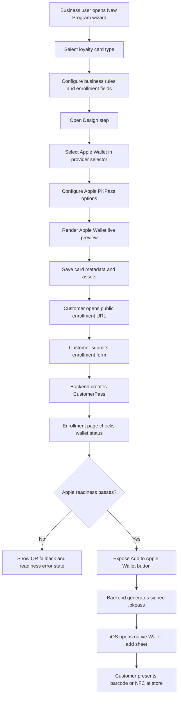
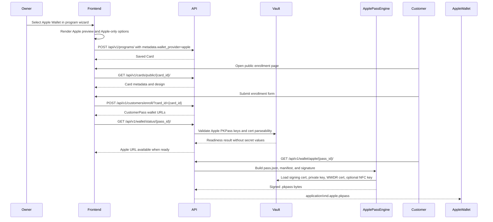

# Apple Wallet Web PKPass And NFC Architecture

**Document ID:** LOYALLIA-WALLET-APPLE-WEB-PKPASS-NFC-001  
**Status:** ACTIVE PRODUCT ARCHITECTURE  
**Date:** 2026-05-03  

This document supersedes the earlier Verify with Wallet checklist for the current Loyallia product path. Loyallia is a web SaaS that lets businesses create wallet cards and lets end customers add those cards to Apple Wallet from a browser. Loyallia is not currently building a native iOS app.

Apple account usernames and passwords SHALL NOT be stored in code, `.env`, CI, docs, or Vault. Apple-issued certificates, identifiers, and private keys SHALL be stored in Vault only.

## Correct Scope

Loyallia SHALL use Apple Wallet passes (`.pkpass`) for loyalty cards, stamp cards, coupons, memberships, gift cards, and similar customer-facing passes.

Loyallia SHALL NOT require Apple's Verify with Wallet identity API for the current web-app product. Verify with Wallet is for requesting identity data from a user's ID in Wallet and requires a native app entitlement flow. That is not the same as issuing loyalty cards to Apple Wallet.

## Provider Selection UX

The program creation screen SHALL present Apple Wallet and Google Wallet selection on the same design screen as the live card preview.

- Apple Wallet SHALL use the web PKPass flow in this document.
- Google Wallet SHALL continue to use the existing Google Wallet JWT flow.
- Apple implementation work SHALL NOT rewrite the Google Wallet generator.

The selected provider SHALL be stored on the card as `metadata.wallet_provider`. Accepted values are:

| Value | Meaning |
|---|---|
| `apple` | Public enrollment exposes the Apple Wallet `.pkpass` path when Apple readiness passes. |
| `google` | Public enrollment exposes the existing Google Wallet save URL path when Google readiness passes. |
| missing / `both` | Legacy behavior for existing cards; both providers may be exposed when configured. |

Apple-specific options SHALL be stored under `metadata.apple_wallet`. The current supported options are:

| Key | Purpose |
|---|---|
| `nfc_enabled` | Enables Apple `pass.json.nfc` only for this card when Vault NFC material exists. |
| `nfc_requires_authentication` | Adds Apple `requiresAuthentication` to the NFC dictionary. |
| `nfc_message` | Optional NFC payload override; if absent, the customer pass QR/barcode value is used. |

## User Flow

1. A business user creates a loyalty card/program in the Loyallia dashboard.
2. Loyallia stores the card design, rules, enrollment form, QR/barcode settings, and optional NFC configuration.
3. Loyallia publishes a public enrollment URL and/or QR code for that card.
4. A customer opens the enrollment URL in Safari or another browser.
5. The customer enters the requested enrollment data.
6. Loyallia creates a `Customer`, `CustomerPass`, and enrollment record.
7. Loyallia generates a signed `.pkpass` file.
8. The customer taps "Add to Apple Wallet" and iOS opens the native Wallet add sheet.
9. After the pass is installed, the customer can present it in-store by QR/barcode or NFC, depending on the card configuration and Apple approval.
10. Loyallia updates the pass by regenerating the `.pkpass` with the same pass type identifier and serial number so Wallet treats it as the same pass instance.

## Apple Creation Flow



## Apple Sequence



## Apple Requirements For Standard Web Wallet Passes

These are required for normal Apple Wallet pass generation from a web app:

| Item | Required | Stored In Vault | Notes |
|---|---:|---:|---|
| Apple Developer Team ID | Yes | Yes | Non-secret identifier. |
| Pass Type ID | Yes | Yes | Must start with `pass.` and use reverse DNS style. |
| Pass Type ID certificate | Yes | Yes | Apple-issued signing certificate for the Pass Type ID. |
| Pass Type private key | Yes | Yes | Generated from the CSR process; secret. |
| Pass Type private key passphrase | Unsupported | N/A | The signing code loads the key with `password=None`; encrypted keys are not supported. |
| Apple WWDR certificate | Yes | Yes | Required for PKPass signing chain. |

## Additional Apple Requirements For NFC Passes

NFC-enabled Apple Wallet passes are still `.pkpass` files, but they require additional Apple approval and pass fields.

Apple documents the `nfc` pass object with:

- `message`: the NFC payload transmitted to an Apple Pay / VAS-capable terminal. Apple limits this payload to 64 bytes.
- `encryptionPublicKey`: a Base64-encoded X.509 SubjectPublicKeyInfo ECDH P-256 public key.
- `requiresAuthentication`: optional; when true, the user must authenticate for NFC use.

Apple states that adding NFC to a pass requires a special entitlement issued by Apple. Loyallia SHALL treat NFC as a gated feature, not as generally available by default.

NFC production requirements:

| Item | Required | Stored In Vault | Notes |
|---|---:|---:|---|
| Apple approval for NFC-enabled passes | Yes | No | Operator evidence, not a secret. |
| Pass Type ID with NFC support / certificate type | Yes | Yes | Apple API exposes `PASS_TYPE_ID_WITH_NFC` as a certificate type. |
| NFC encryption public key | Yes | Yes | Public key used in the `nfc.encryptionPublicKey` field. |
| NFC message policy | Yes | Config/database | Payload must be tenant/pass scoped and 64 bytes or less. |
| NFC-capable reader/VAS terminal test path | Yes | No | Must be verified with real hardware before production claim. |

## Required Vault Keys

Core Apple Wallet keys:

| Vault Key | Purpose | Secret |
|---|---|---:|
| `apple_team_identifier` | Apple Developer Team ID | No |
| `apple_pass_type_identifier` | Pass Type ID used in `pass.json` | No |
| `apple_cert_pem` | Pass Type ID signing certificate | Yes |
| `apple_cert_key_pem` | Pass Type ID private key | Yes |
| `apple_wwdr_cert_pem` | Apple WWDR intermediate certificate | No |

NFC keys:

| Vault Key | Purpose | Secret |
|---|---|---:|
| `apple_nfc_enabled` | Operator gate for NFC pass generation | No |
| `apple_nfc_encryption_public_key` | Public key embedded in the pass `nfc` dictionary | Yes |

The current web-app Wallet path SHALL NOT require these Verify with Wallet identity keys:

- `apple_verify_bundle_id`
- `apple_verify_merchant_id`
- `apple_verify_document_types`
- `apple_verify_requested_elements`
- `apple_verify_identity_cert_pem`
- `apple_verify_identity_private_key_pem`
- `apple_iaca_certificates_pem`

Those keys are reserved for a future native iOS identity verification product, if Loyallia later builds one.

## Operator Setup Steps

1. In Apple Developer, create or confirm a Pass Type ID for Loyallia passes.
2. If NFC is required, request/confirm Apple approval for NFC-enabled passes before production use.
3. Generate a CSR locally on a controlled machine.
4. Create a Pass Type ID certificate for the Pass Type ID. For NFC, use the Apple-approved NFC-capable certificate path where available.
5. Download the Apple-issued certificate.
6. Export the certificate and private key to PEM locally.
7. Download the Apple WWDR certificate.
8. Store the PEM material and identifiers in Vault.
9. Run the non-secret readiness command.
10. Generate a test pass and install it on a real iPhone.
11. For NFC, validate the pass with the real NFC/VAS reader hardware intended for production.

## Readiness Commands

The Apple web Wallet readiness gate should validate only the PKPass and optional NFC keys:

```bash
docker compose exec -T api python manage.py check_vault_config
docker compose exec -T api python manage.py check_apple_wallet_config
```

The `check_apple_wallet_config` command SHALL validate the web PKPass scope only: Pass Type ID, Team ID, PKPass signing certificate, PKPass private key, WWDR certificate, and optional NFC public key.

## Acceptance Criteria

Apple Wallet web pass readiness is accepted only when:

- Vault is unsealed and required Apple PKPass keys exist.
- The Apple certificate, private key, and WWDR certificate parse successfully.
- A real `.pkpass` is generated by the backend.
- The generated `.pkpass` opens the native Add to Apple Wallet sheet on a real iPhone.
- The pass installs and displays the expected brand, card fields, barcode/QR, and locations.
- Updating a pass preserves the same Pass Type ID and serial number so Wallet updates the existing pass.
- NFC is disabled unless Apple NFC approval and real hardware verification are complete.
- If NFC is enabled, the generated pass contains a valid `nfc` dictionary, payload is no more than 64 bytes, and the pass is verified with a real NFC/VAS terminal.

## References

- Apple Wallet Passes: https://developer.apple.com/documentation/walletpasses
- Apple Building a Pass: https://developer.apple.com/documentation/walletpasses/building-a-pass
- Apple Creating a Generic Pass: https://developer.apple.com/documentation/walletpasses/creating-a-generic-pass
- Apple Pass NFC object: https://developer.apple.com/documentation/walletpasses/pass/nfc
- Apple Wallet identifiers and certificates: https://developer.apple.com/help/account/configure-app-capabilities/create-wallet-identifiers-and-certificates/
- Apple App Store Connect CertificateType values: https://developer.apple.com/documentation/appstoreconnectapi/certificatetype
