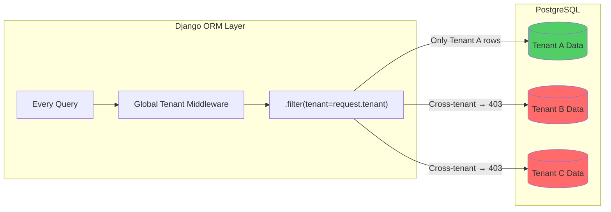
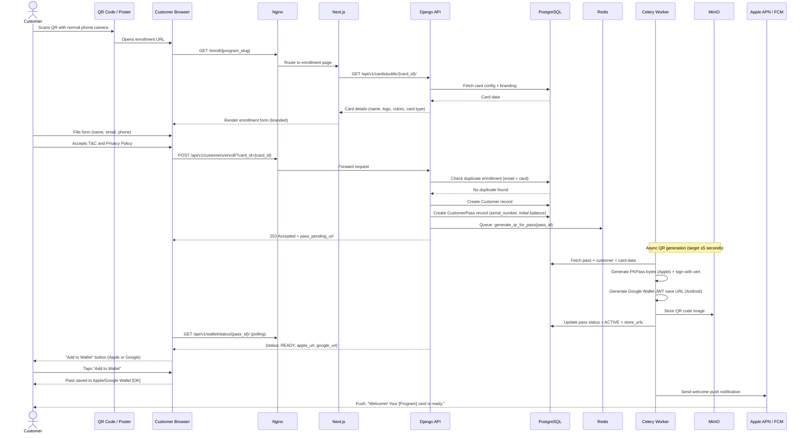
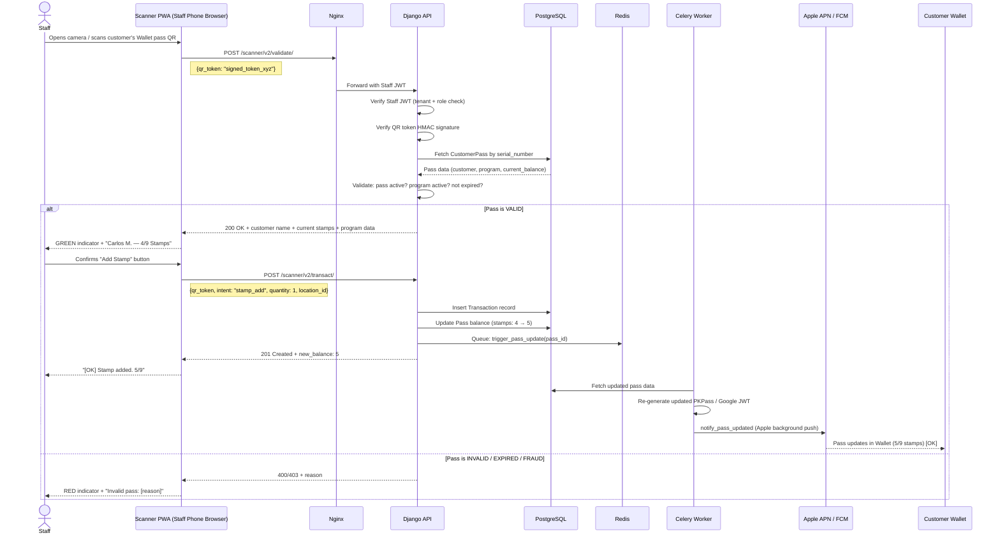
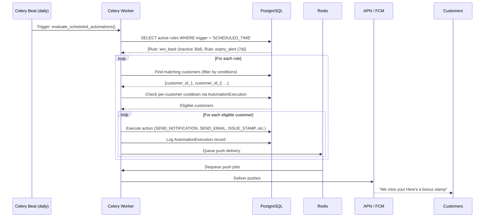
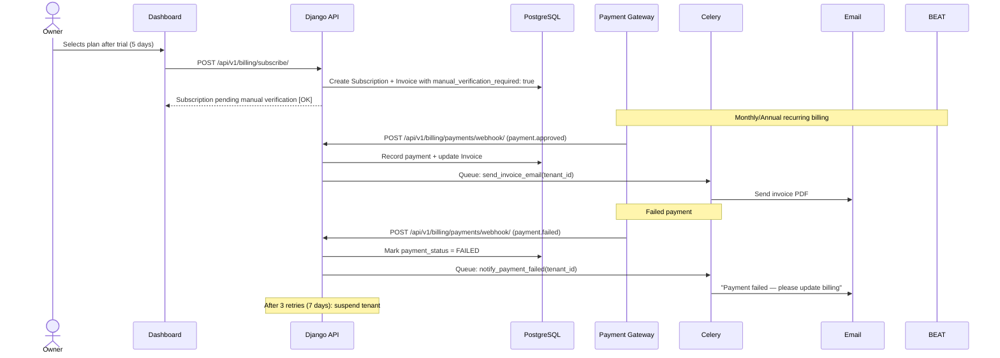
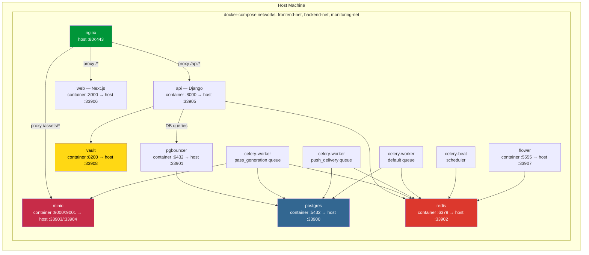
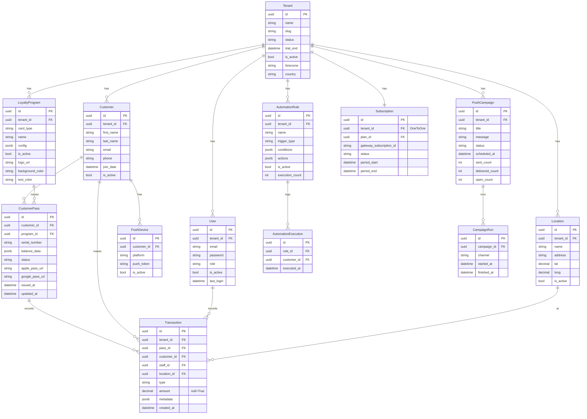

# LOYALLIA — ARCHITECTURE, SEQUENCE & FLOWCHART DIAGRAMS
**Document ID:** LOYALLIA-ARCH-001
**Version:** 1.0.0
**Date:** 2026-04-05
**Reference:** SRS LOYALLIA-SRS-001

## IMPORTANT CLARIFICATION — SCANNER APP ARCHITECTURE

The system has TWO distinct QR scanning flows. This is critical to understand:

| Actor | Scans | With | Purpose |
|-------|-------|------|---------|
| Customer | Business poster QR | Normal phone camera | Enrollment → browser opens → saves pass to Wallet |
| Staff | Customer's Wallet pass QR | **Loyallia Scanner PWA** | Records stamp/cashback/redemption in database |

**Scanner App Decision: PWA (v1.0)**
The staff scanner is implemented as a **Progressive Web App** hosted on the same Django/Next.js stack. Staff open `https://app.loyallia.com/scanner` on their phone browser, log in once, and the browser camera API handles QR scanning. No app store required. React Native is deferred to v2.0 if offline demands require it.

## DIAGRAM 1 — FULL SYSTEM ARCHITECTURE

```mermaid
graph TB
    subgraph "Customer Layer"
        C1[Customer Phone Camera<br/>Normal QR Scan]
        C2[Apple Wallet]
        C3[Google Wallet]
    end

    subgraph "Business Staff Layer"
        S1[Scanner PWA<br/>Staff Phone Browser<br/>loyallia.com/scanner]
    end

    subgraph "Business Owner/Manager Layer"
        D1[Business Dashboard<br/>Next.js Web App<br/>loyallia.com/dashboard]
    end

    subgraph "Loyallia Platform — Docker Network"
        subgraph "Reverse Proxy"
            NX[Nginx<br/>Port 80/443<br/>SSL Termination (dev HTTP only; prod uses host-level nginx)]
        end

        subgraph "Application Layer"
            API[Django 5 + Django Ninja<br/>REST API<br/>Port 33905]
            WEB[Next.js 14<br/>Dashboard + Scanner PWA<br/>Port 33906]
        end

        subgraph "Async Workers"
            CEL[Celery Workers<br/>Pass Generation<br/>Push Delivery<br/>Automation Rules]
            BEAT[Celery Beat<br/>Scheduled Jobs<br/>Win-back, Expiry Alerts]
            FLW[Flower<br/>Worker Monitor<br/>Port 33907]
        end

        subgraph "Data Layer"
            PG[(PostgreSQL 17<br/>Primary Database<br/>Port 33900)]
            RD[(Redis 7<br/>Cache + Queue<br/>Port 33902)]
            PGB[PgBouncer<br/>Connection Pool<br/>Port 33901]
        end

        subgraph "File Storage"
            MIO[MinIO<br/>S3-Compatible Storage<br/>Logos, QR Codes<br/>Port 33903/33904]
        end

        subgraph "Security"
            VLT[HashiCorp Vault<br/>Secret Management<br/>Port 33908]
        end
    end

    subgraph "External Services"
        APN[Apple APN<br/>iOS Push]
        FCM[Google FCM<br/>Android Push]
        GW[Google Wallet API<br/>Pass Issuance]
        GWY[Payment Gateway<br/>Manual / Pluggable]
        SMTP[SMTP Provider<br/>Transactional Email]
    end

    C1 -->|"1. Scans business QR"| NX
    NX --> WEB
    WEB -->|"2. Enrollment form"| C1
    WEB -->|"3. Pass generation request"| API
    API -->|"4. Queue pass job"| RD
    CEL -->|"5. Generate PKPass bytes"| C2
    CEL -->|"6. Generate Google JWT save URL"| GW
    GW --> C3
    CEL -->|"7. Welcome push"| APN
    CEL --> FCM

    S1 -->|"Scan customer pass QR"| NX
    NX --> API
    API --> PGB
    PGB --> PG

    D1 -->|"Dashboard requests"| NX
    NX --> WEB
    WEB --> API

    API -->|"Push campaigns"| RD
    CEL -->|"Deliver push"| APN
    CEL -->|"Deliver push"| FCM
    CEL -->|"Process payment"| GWY
    CEL -->|"Send email"| SMTP
    API -->|"Read secrets"| VLT

    BEAT -->|"Schedule jobs"| RD
    CEL -->|"Pass updates"| APN
    CEL -->|"Pass updates"| FCM
```

## DIAGRAM 2 — MULTI-TENANT DATA ISOLATION MODEL



## DIAGRAM 3 — SEQUENCE: CUSTOMER ENROLLMENT FLOW



## DIAGRAM 4 — SEQUENCE: STAFF QR SCAN TRANSACTION (STAMP CARD)



## DIAGRAM 5 — SEQUENCE: GEO-FENCING PUSH NOTIFICATION

```mermaid
sequenceDiagram
    participant Wallet as Customer Apple Wallet
    participant APN as Apple APN Server
    participant CEL as Celery + Backend

    Note over Wallet: Pass contains locations[] array<br/>with business lat/long + 100m radius

    Wallet->>Wallet: Device detects customer enters 100m radius
    Wallet->>APN: Trigger location-based notification
    APN-->>Wallet: Show lock-screen notification<br/>"You're near [Business Name]!"

    Note over CEL,APN: Android geofencing is planned/future; not implemented.
```

## DIAGRAM 6 — SEQUENCE: AUTOMATION RULE EXECUTION



## DIAGRAM 7 — SEQUENCE: TENANT SUBSCRIPTION BILLING



## DIAGRAM 8 — FLOWCHART: COMPLETE ENROLLMENT FLOW

```mermaid
flowchart TD
    A([Customer Sees QR Poster]) --> B[Scans QR with Phone Camera]
    B --> C[Browser Opens Enrollment Page]
    C --> D{Is customer\nalready enrolled?}
    D -->|Yes| E[Show: Re-send Pass to Wallet option]
    D -->|No| F[Display branded enrollment form]
    F --> G[Customer fills: Name, Email, Phone]
    G --> H[Customer accepts T&C + Privacy Policy]
    H --> I[POST /api/v1/customers/enroll/?card_id={card_id}]
    I --> J{Validation\nPassed?}
    J -->|No| K[Show field errors → Return to form]
    J -->|Yes| L[Create Customer + CustomerPass in DB]
    L --> M[Queue async QR generation job]
    M --> N{Device type?}
    N -->|iOS| O[Generate PKPass bytes + sign with Apple cert]
    N -->|Android| P[Generate Google Wallet JWT save URL]
    O --> Q[Store QR code image in MinIO]
    P --> Q
    Q --> R[Update pass status = ACTIVE]
    R --> S[GET /api/v1/wallet/status/{pass_id}/]
    S --> T[Customer taps Add to Wallet]
    T --> U[Pass saved to Wallet [OK]]
    U --> V[Send welcome push notification]
    V --> W([Enrollment Complete])

    E --> X[Resend pass link to email]
    X --> W
```

## DIAGRAM 9 — FLOWCHART: SCANNER APP VALIDATION

```mermaid
flowchart TD
    A([Staff opens Scanner PWA]) --> B{Authenticated?}
    B -->|No| C[Login with staff credentials]
    C --> D[Select business location]
    D --> E[Scanner screen]
    B -->|Yes| E

    E --> F[Open camera — scan customer Wallet QR]
    F --> G{Online?}
    G -->|Yes| H[POST /scanner/v2/validate/]
    G -->|No| I[Offline validation with cached HMAC key]
    I --> J{Local signature valid?}
    J -->|No| K[RED — Invalid Pass]
    J -->|Yes| L[Queue transaction locally]
    L --> M[GREEN — show cached customer data]
    M --> N[Staff confirms action]
    N --> O[Store to offline queue]
    O --> P{Connection restored?}
    P -->|Yes| Q[Sync offline queue to API]
    P -->|No| R[Keep in queue]

    H --> S{API Response}
    S -->|Valid| T[GREEN [OK] Show customer name + balance]
    S -->|Invalid| K
    S -->|Expired| U[YELLOW [WARN] Pass Expired]
    S -->|Fraud| V[RED [BLOCKED] Fraud Alert]

    T --> W{Card type action}
    W -->|Stamp| X[Tap to add stamp + confirm]
    W -->|Cashback| Y[Enter purchase amount → calculate credit]
    W -->|Coupon| Z[Confirm redemption]
    W -->|Gift/Multipass| AA[Enter amount used → decrement balance]
    W -->|Membership/Corporate| BB[Confirm visit + show discount]

    X & Y & Z & AA & BB --> CC[POST /scanner/v2/transact/]
    CC --> DD[DB updated + Wallet pass updated ≤30s]
    DD --> EE([Transaction Complete [OK]])
```

## DIAGRAM 10 — FLOWCHART: PUSH CAMPAIGN DELIVERY

```mermaid
flowchart TD
    A([Manager creates push campaign]) --> B[Select: Title + Message + Image]
    B --> C[Select Target Audience]
    C --> D{Audience filters}
    D -->|segment_id| E[Filter by segment]
    D -->|target_program_ids| F[Filter by card/program]
    D -->|target_device_type| G[Filter by iOS/Android]
    D -->|target_wallet_platform| H[Filter by Apple/Google Wallet]
    D -->|target_customer_ids| I[Filter by explicit customer list]

    E & F & G & H & I --> J[Estimate reach count]
    J --> K{Send now or\nschedule?}
    K -->|Schedule| L[Set date/time + timezone]
    K -->|Send now| M[Queue campaign job in Redis]
    L --> N[Celery Beat triggers at scheduled time]
    N --> M

    M --> O[Celery worker dequeues batch]
    O --> P{Campaign channel}
    P -->|Wallet push| Q[send_wallet_notification_campaign]
    P -->|WhatsApp| R[send_whatsapp_campaign]

    Q --> S{Device OS / platform}
    S -->|iOS| T[Send via Apple APN HTTP/2]
    S -->|Android| U[Send via Google FCM API]
    S -->|Apple Wallet| V[notify_pass_updated (background push)]
    S -->|Google Wallet| W[notify_pass_updated (Google Wallet push)]

    T & U & V & W --> X{Delivery result}
    X -->|Success| Y[Log: delivered_count++]
    X -->|Invalid Token| Z[Mark token invalid in DB]
    X -->|Failed| AA[Retry up to 3x]

    Y & Z --> AB[Update campaign stats]
    AA --> AC{Retry count <= 3?}
    AC -->|Yes| O
    AC -->|No| AD[Log permanent failure]
    AD --> AB

    AB --> AE([Campaign Complete — Show open rate in Dashboard])
```

## DIAGRAM 11 — DEPLOYMENT DIAGRAM (DOCKER COMPOSE)

> **Note:** The diagram below is simplified. The real Compose topology uses three networks (`frontend-net`, `backend-net`, `monitoring-net`) and includes additional services not shown here: `postgres-replica`, `redis-sentinel`, `minio-init`, `vault`, `vault-init`, `whatsapp-bridge`, `prometheus`, `grafana`, `loki`, and `alertmanager`.



## DIAGRAM 12 — ENTITY RELATIONSHIP DIAGRAM (CORE TABLES)

> ⚠️ **Source of truth:** The actual models are in `backend/apps/*/models.py`. This diagram is **illustrative** and may not match current model fields, table names, or relationships. Always verify against the current Django models and migrations.



## APPENDIX A — Recent Architecture Changes (2026-05-06)

This appendix documents all backend, frontend, and infrastructure changes made during the 2026-05-06 configuration session. Agents MUST read this before modifying any of the affected subsystems.

### A.1 Subscription Plan Rate Limits

**Motivation:** Existing plans only had basic limits (`max_locations`, `max_customers`, etc.). The platform needed granular rate limits for enterprise features.

**Changes:**
- `apps/billing/models.py` — `SubscriptionPlan` defines 16 resource-limit fields plus the derived `wallet_ai_designs_month` alias:
  - `max_locations`, `max_users`, `max_customers`, `max_programs`
  - `max_notifications_month`, `max_transactions_month`
  - `max_whatsapp_day`, `max_emails_month`, `max_sms_day`, `max_wallet_pushes_month`
  - `max_automations`, `max_automation_executions_day`
  - `max_ai_queries_month`, `max_api_calls_day`, `max_exports_month`
  - `max_wallet_templates`, `max_wallet_pass_updates_month`
- Migration `0007_add_rate_limit_fields` — adds columns + CHECK constraints
- `common/plan_enforcement.py` — `_count_api_calls_day()` now queries `AgentAPICallLog` instead of returning 0
- Public billing API — returns all 17 rate-limit fields in plan responses

**Database Fix Note:**
If migration `0007` is recorded in `django_migrations` but columns are missing from `loyallia_subscription_plans`, apply the fix in `docs/01-start-here/AGENT_ONBOARDING.md` §7 (Common Issues).

### A.2 Agent API Call Logging

**Motivation:** Need to enforce `max_api_calls_day` plan limit accurately.

**Changes:**
- `apps/agent_api/models.py` — new `AgentAPICallLog` model:
  ```python
  class AgentAPICallLog(models.Model):
      id = UUIDField(primary_key=True, default=uuid.uuid4)
      tenant = ForeignKey(Tenant, on_delete=CASCADE, db_index=True)
      endpoint = CharField(max_length=255)
      method = CharField(max_length=10)
      status_code = PositiveSmallIntegerField(null=True, blank=True)
      created_at = DateTimeField(auto_now_add=True, db_index=True)
  ```
- Migration created and applied
- `plan_enforcement._count_api_calls_day()` uses this model for per-tenant daily counts

### A.3 Vault Write API

**Motivation:** SuperAdmin needed a way to update secrets at runtime without CLI access.

**Changes:**
- `common/vault.py` — added `put_secret(key, value)`:
  - Reads current Vault data, merges new key, writes back via KV v2 API
  - Calls `clear_cache()` to force re-fetch
- `apps/tenants/super_admin_api/platform.py` — added endpoint:
  ```
  PUT /api/v1/admin/platform/integrations/{integration_key}/secret/
  Body: {"key": "vault_key_name", "value": "secret_value"}
  ```
  - Validates `key` against per-integration `ALLOWED_KEYS` allowlist
  - Returns 400 if key not allowed for that integration
  - Supports 13 integration groups (see `backend/apps/tenants/super_admin_api/integration_config.py`)

**ALLOWED_KEYS per integration:**
```python
"google_wallet": [
    "google_wallet_enabled",
    "google_wallet_issuer_id",
    "google_service_account_json",
    "google_oauth_client_id",
    "google_oauth_client_secret",
],
"apple_wallet": [
    "apple_wallet_enabled",
    "apple_pass_type_identifier",
    "apple_team_identifier",
    "apple_cert_pem",
    "apple_cert_key_pem",
    "apple_wwdr_cert_pem",
],
"payment_gateway": [
    "payment_gateway_enabled",
    "payment_gateway_provider",
    "payment_gateway_login",
    "payment_gateway_tran_key",
    "payment_gateway_webhook_secret",
],
"mailjet": [
    "mailjet_api_key",
    "mailjet_secret_key",
],
"google_oauth": [
    "google_oauth_client_id",
    "google_oauth_client_secret",
],
"whatsapp_bridge": [
    "whatsapp_bridge_url",
    "whatsapp_bridge_api_key",
],
"twilio_sms": [
    "twilio_account_sid",
    "twilio_auth_token",
    "twilio_from_number",
],
"twilio_verify": [
    "twilio_verify_enabled",
    "twilio_verify_service_sid",
    "twilio_verify_default_channel",
],
"twilio_api_key": [
    "twilio_api_key_sid",
    "twilio_api_key_secret",
],
"twilio_test": [
    "twilio_test_account_sid",
    "twilio_test_auth_token",
],
"apple_nfc": [
    "apple_nfc_enabled",
    "apple_nfc_encryption_public_key",
],
"ai_agent": [
    "ai_agent_base_url",
    "ai_agent_api_key",
],
"backup_config": [
    "vault_thresholds",
    "backup_frequency",
    "backup_retention",
    "cron_hour",
    "system_mode",
],
```

### A.4 Integration Diagnostics

**Motivation:** SuperAdmin settings page needed to show WHY an integration was failing.

**Changes:**
- `platform_integrations()` now returns a `diagnostics` object per integration:
  ```json
  {
    "enabled": true,
    "issuer_id_present": true,
    "service_account_present": true,
    "service_account_valid_json": true,
    "service_account_has_required_fields": true,
    "errors": []
  }
  ```
- `google_pass.py` — `get_google_wallet_diagnostics()` checks SA JSON has `client_email`, `private_key`, `token_uri`
- `apple_pass.py` — `get_apple_wallet_diagnostics()` checks all PEMs are present and cryptographically valid via `OpenSSL.crypto`
- `platform.py` integration endpoint — no secrets exposed in response

### A.5 Environment Validation Fix

**Motivation:** API container crashed on startup when email or Apple Wallet credentials were not configured.

**Changes:**
- `common/env_validation.py`:
  - Removed Mailjet and Apple Wallet credentials from unconditional `PRODUCTION_REQUIRED_VAULT_KEYS`
  - Added `EMAIL_REQUIRED_VAULT_KEYS` list
  - Mailjet credentials only validated if `mailjet_api_key` is non-empty
  - Apple Wallet fields only validated if `apple_wallet_enabled` is truthy
  - `payment_gateway` fields only validated if `payment_gateway_enabled` is truthy

This allows the system to boot with a subset of integrations configured.

### A.6 Frontend Settings Page

**Motivation:** Monolithic plans page and read-only settings were inadequate.

**Changes:**
- `src/app/(dashboard)/superadmin/settings/page.tsx`:
  - Inline Vault editor for ALL integrations (not just Google/Apple)
  - Per-field inputs with diagnostic status indicators
  - Password-type fields for secrets
  - Select dropdowns for enum values (`true`/`false`, provider names)
- `src/lib/api.ts`:
  - `superAdminApi` object with structured endpoint paths
- `src/components/superadmin/plans/PlanModal.tsx`:
  - Full-screen modal (`w-full h-full`)
  - `is_active` toggle
  - Reactivation flow for inactive plans
  - Plan deactivation guard (shows 409 if active subscribers exist)

### A.7 SuperAdmin API Security Fixes

**Motivation:** Integration endpoint was leaking secrets.

**Changes:**
- Removed `GOOGLE_WALLET_ISSUER_ID` from `detail` field (was exposed in API response)
- `EMAIL_HOST_PASSWORD` now read via `get_secret()` instead of direct env access
- Integration diagnostics object added — no secrets in response body

### A.8 Certificate File Audit (`certs/`)

**Real files (kept):**
| File | Purpose |
|------|---------|
| `passNew.cer` | Ignored local Apple Pass Type ID certificate |
| `apple_pass_new.key` | Ignored local Apple private key |
| `apple_pass_new.csr` | Ignored local CSR |
| `AppleWWDRCAG4.cer` | Ignored local Apple WWDR intermediate certificate |
| `client_secret_*.json` | Ignored local Google OAuth client secrets |
| `service-account-*.json` | Ignored local Google Wallet service account |

**Removed files (were sanitized placeholders):**
- `apple_pass.key`, `apple_pass_cert.pem`, `apple_wwdr.pem`, `apple_pass.csr`, `pass.cer`

**Verification:**
```bash
# Confirm passNew.cer matches apple_pass_new.key
openssl x509 -in certs/passNew.cer -inform DER -pubkey -noout | openssl rsa -pubin -modulus -noout
openssl rsa -in certs/apple_pass_new.key -pubout | openssl rsa -pubin -modulus -noout
```

### A.9 Documentation Created/Updated

| Document | Status | Purpose |
|----------|--------|---------|
| `AGENT.md` | Updated | Agent directives, stack rules, wallet specs |
| `docs/01-start-here/AGENT_ONBOARDING.md` | **New** | Complete onboarding for future agents |
| `docs/02-architecture/ARCHITECTURE.md` | Updated | This appendix added |
| `docs/08-references/WALLET_CREDENTIALS_STATUS.md` | **New** | Real credential audit |
| `docs/08-references/WALLET_CREDENTIALS_SETUP.md` | Updated | Step-by-step credential acquisition |
| `docs/08-references/GOOGLE_SETUP_STEP_BY_STEP.md` | **New** | Google OAuth + Wallet setup guide |
| `scripts/inject_wallet_credentials.py` | **New** | Helper script for Vault injection |
| `README.md` | Updated | Quick start + credential setup notes |
