# LOYALLIA — ARCHITECTURE, SEQUENCE & FLOWCHART DIAGRAMS
**Document ID:** LOYALLIA-ARCH-001  
**Version:** 1.0.0  
**Date:** 2026-04-05  
**Reference:** SRS LOYALLIA-SRS-001  

---

## IMPORTANT CLARIFICATION — SCANNER APP ARCHITECTURE

The system has TWO distinct QR scanning flows. This is critical to understand:

| Actor | Scans | With | Purpose |
|-------|-------|------|---------|
| Customer | Business poster QR | Normal phone camera | Enrollment → browser opens → saves pass to Wallet |
| Staff | Customer's Wallet pass QR | **Loyallia Scanner PWA** | Records stamp/cashback/redemption in database |

**Scanner App Decision: PWA (v1.0)**  
The staff scanner is implemented as a **Progressive Web App** hosted on the same Django/Next.js stack. Staff open `https://app.loyallia.com/scanner` on their phone browser, log in once, and the browser camera API handles QR scanning. No app store required. React Native is deferred to v2.0 if offline demands require it.

---

## DIAGRAM 1 — FULL SYSTEM ARCHITECTURE

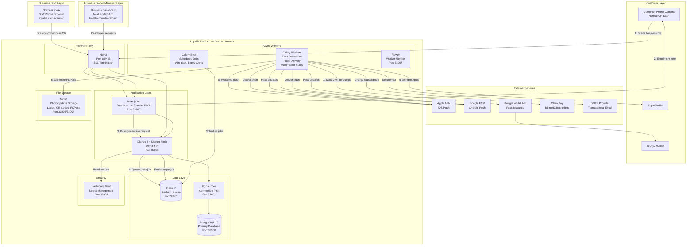

---

## DIAGRAM 2 — MULTI-TENANT DATA ISOLATION MODEL

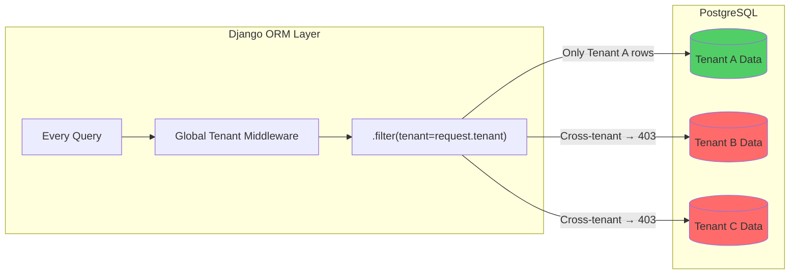

---

## DIAGRAM 3 — SEQUENCE: CUSTOMER ENROLLMENT FLOW

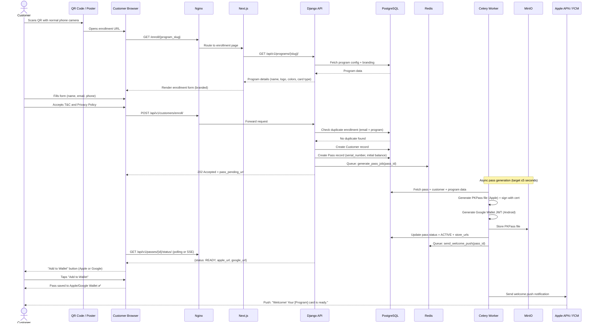

---

## DIAGRAM 4 — SEQUENCE: STAFF QR SCAN TRANSACTION (STAMP CARD)

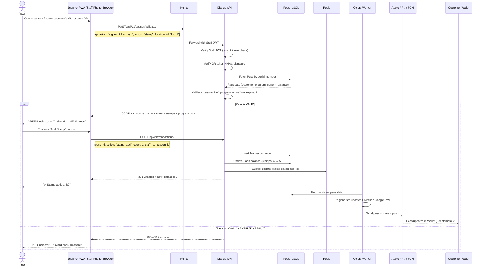

---

## DIAGRAM 5 — SEQUENCE: GEO-FENCING PUSH NOTIFICATION

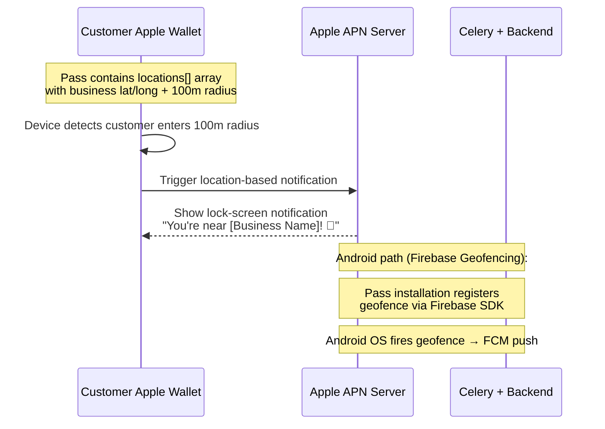

---

## DIAGRAM 6 — SEQUENCE: AUTOMATION RULE EXECUTION

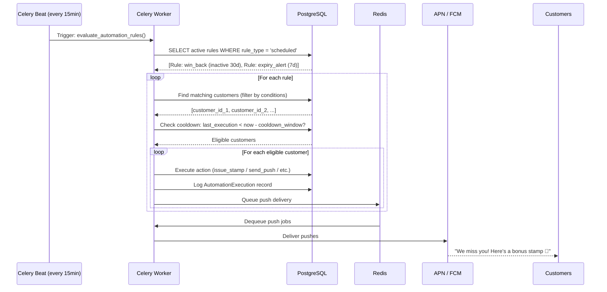

---

## DIAGRAM 7 — SEQUENCE: TENANT SUBSCRIPTION BILLING

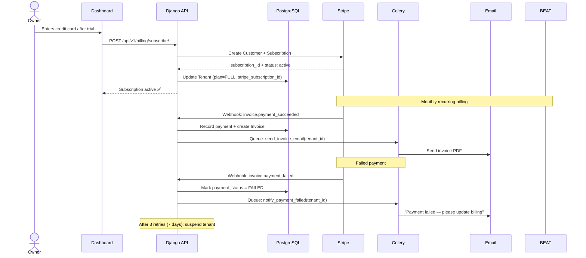

---

## DIAGRAM 8 — FLOWCHART: COMPLETE ENROLLMENT FLOW

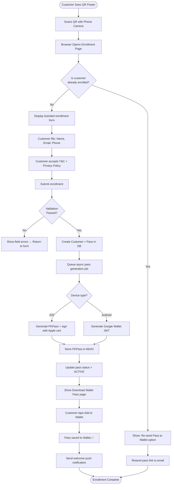

---

## DIAGRAM 9 — FLOWCHART: SCANNER APP VALIDATION

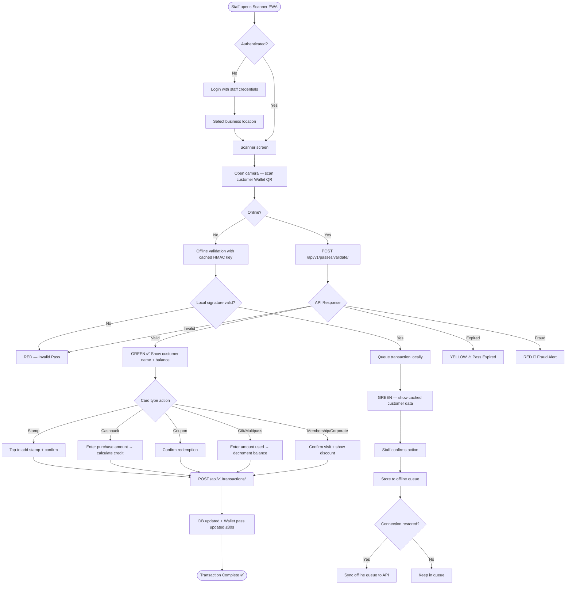

---

## DIAGRAM 10 — FLOWCHART: PUSH CAMPAIGN DELIVERY

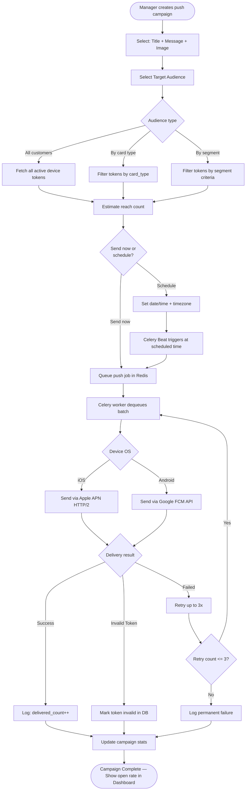

---

## DIAGRAM 11 — DEPLOYMENT DIAGRAM (DOCKER COMPOSE)

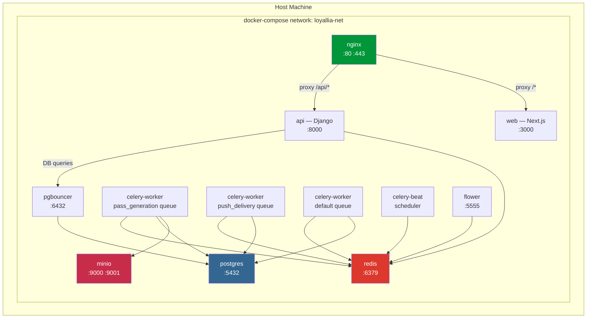

---

## DIAGRAM 12 — ENTITY RELATIONSHIP DIAGRAM (CORE TABLES)

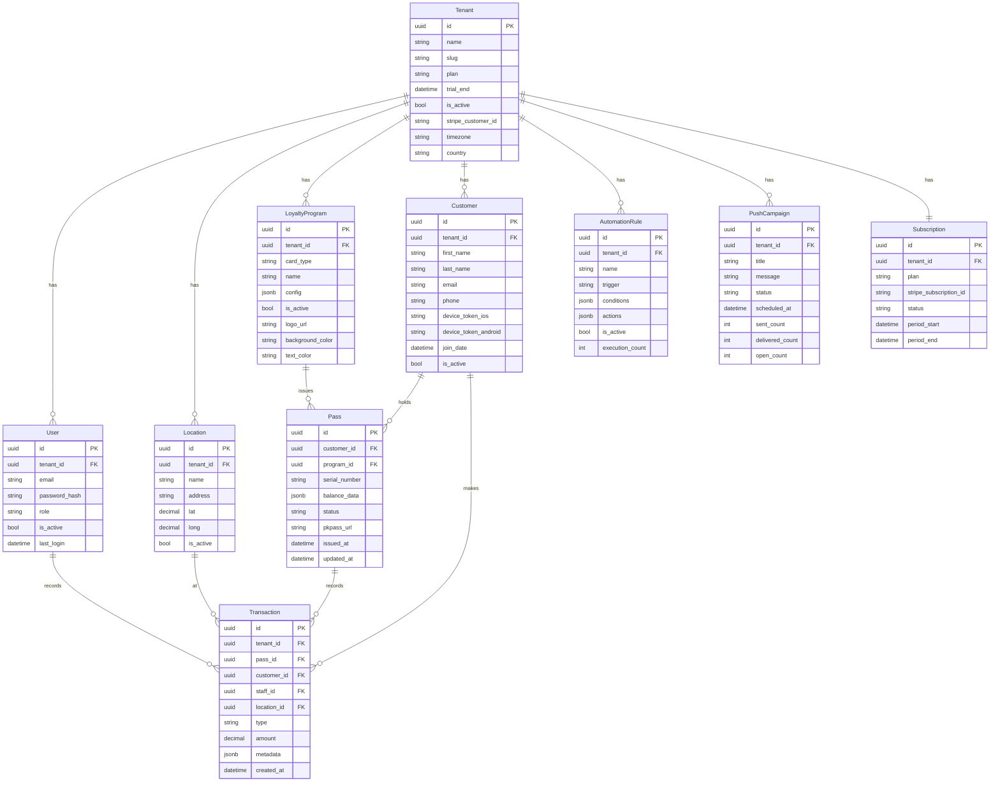
